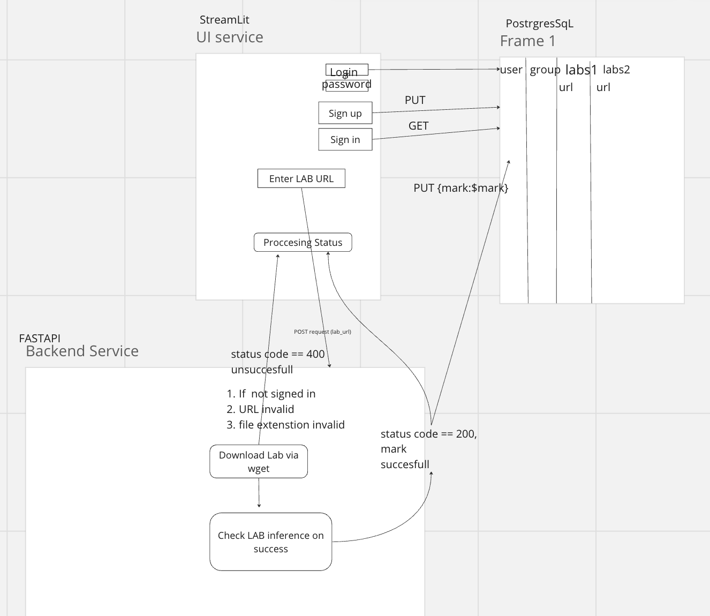

# Labs Checker
## Content
- [Project structure](#project-structure)
- [Installation](#installation)

### Project structure


### Installation
1. Create venv for backend
```

python3 -m venv src/backend/.backend_venv
source src/backend/.backend_venv/bin/activate
pip3 install -r src/backend/requirements.txt
```
2. Create venv for ui
```
python3 -m venv src/ui/.ui_venv
source src/ui/.ui_venv/bin/activate
pip3 install -r src/ui/requirements.txt
```
3. Run application
```
python src/backend/app.py
streamlit run src/ui/ui.py --server.port 8080

```
### Installation (Windows Edition)
1. Create venv for backend
```

python -m venv .\src\backend
.\src\backend\Scripts\activate.bat
python -m pip install -r .\src\backend\requirements.txt
```
2. Create venv for ui
```
python -m venv .\src\ui
.\src\ui\Scripts\activate.bat
python -m pip install -r .\src\ui\requirements.txt
```
3. Run application
```
python src/backend/app.py
streamlit run src/ui/ui.py --server.port 8080
```